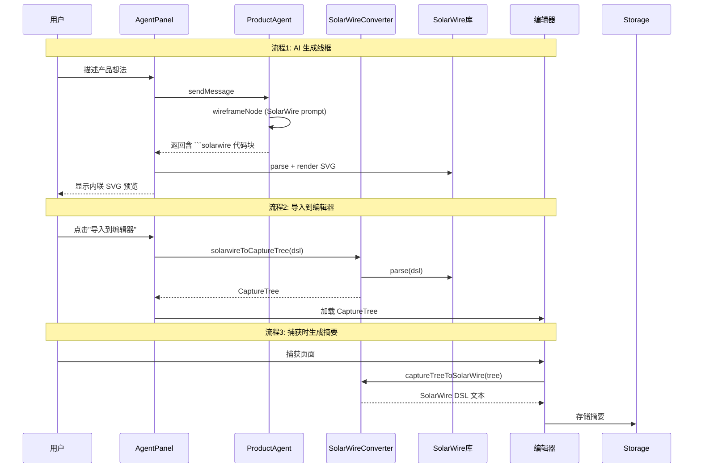

# 设计文档：SolarWire DSL 集成

## 概述

本设计在 H2D Studio 现有架构（Express + React + Zustand + 文件系统存储）基础上，集成 SolarWire DSL 作为 AI 生成线框/高保真的中间表示层。核心变更包括：

1. 新增 `solarwireConverter.ts` 服务，实现 SolarWire ↔ CaptureTree 双向转换
2. 修改 `productAgent.ts` 中的 WIREFRAME_PROMPT 和 HIFI_PROMPT，改为指导 AI 输出 SolarWire DSL
3. 新增 `solarwire.ts` 路由，提供解析、渲染、转换 API 端点
4. 增强 `AgentPanel.tsx`，检测 SolarWire 代码块并渲染内联 SVG 预览
5. 增强 `knowledgeBase.ts`，在页面捕获时自动生成 SolarWire 结构摘要并存储
6. 增强知识库，提取和存储 SolarWire 结构模式供 AI 参考

SolarWire 通过 `npm install github:SolarWire/SolarWire` 安装，提供 `parse()` 和 `render()` 两个核心 API。

## 架构

### 整体架构图

```mermaid
graph TB
    subgraph Frontend ["前端 (web/src/)"]
        AP[AgentPanel.tsx 增强<br/>SolarWire SVG 预览]
        SWP[SolarWirePreview.tsx 新组件<br/>SVG 渲染 + 导入按钮]
    end

    subgraph Backend ["后端 (server/src/)"]
        subgraph Routes
            SWR[solarwire.ts 新路由<br/>parse / render / convert]
            AR[agent.ts 路由]
            PR[projects.ts 路由]
        end

        subgraph Services
            SWC[solarwireConverter.ts 新服务<br/>双向转换核心]
            PAS[productAgent.ts 增强<br/>SolarWire 提示词]
            KBS[knowledgeBase.ts 增强<br/>SolarWire 摘要存储]
            SS[storage.ts 增强<br/>捕获时触发摘要生成]
        end

        subgraph External
            SW[SolarWire 库<br/>parse + render-svg]
        end
    end

    subgraph Storage ["文件存储 (server/data/)"]
        PK[projects/{id}/knowledge.json<br/>新增 solarwireSummaries 字段]
        PS[projects/{id}/pages/{pageId}/solarwire.txt<br/>页面 SolarWire 摘要]
    end

    AP --> SWR
    AP --> SWP
    SWP --> SWR

    SWR --> SWC
    AR --> PAS
    PR --> SS

    SWC --> SW
    PAS --> SWC
    KBS --> SWC
    SS --> KBS

    KBS --> PK
    KBS --> PS
```

### 数据流



### 变更范围

| 模块 | 变更类型 | 文件 |
|------|---------|------|
| SolarWire 转换 | 新增 | server/src/services/solarwireConverter.ts |
| SolarWire 路由 | 新增 | server/src/routes/solarwire.ts |
| SolarWire 预览 | 新增 | web/src/components/agent/SolarWirePreview.tsx |
| AI 助手提示词 | 修改 | server/src/services/productAgent.ts |
| 聊天面板 | 修改 | web/src/components/agent/AgentPanel.tsx |
| 知识库服务 | 修改 | server/src/services/knowledgeBase.ts |
| 存储服务 | 修改 | server/src/services/storage.ts |
| 类型定义 | 修改 | server/src/types.ts |
| 路由注册 | 修改 | server/src/index.ts |

## 组件与接口

### 1. SolarWire 转换服务

#### 核心模块

```typescript
// server/src/services/solarwireConverter.ts

import { parse } from 'solarwire';
import { render } from 'solarwire/renderer-svg';

// ========== SolarWire → CaptureTree ==========

interface ConvertResult {
  success: true;
  captureTree: CaptureTree;
}

interface ConvertError {
  success: false;
  error: {
    message: string;
    line?: number;
    column?: number;
  };
}

/**
 * 将 SolarWire DSL 文本转换为 CaptureTree
 * 1. 调用 SolarWire parse() 获取 AST
 * 2. 遍历 AST 节点，映射为 ElementSnapshot / TextSnapshot
 * 3. 组装为完整 CaptureTree
 */
export function solarwireToCaptureTree(
  dsl: string,
  options?: { title?: string; width?: number; height?: number }
): ConvertResult | ConvertError;

/**
 * 将 SolarWire DSL 渲染为 SVG 字符串
 * 直接调用 SolarWire 库的 render()
 */
export function solarwireToSVG(dsl: string): { success: true; svg: string } | ConvertError;

// ========== CaptureTree → SolarWire ==========

/**
 * 将 CaptureTree 转换为 SolarWire DSL 文本
 * 遍历树结构，根据节点样式选择合适的 SolarWire 语法
 */
export function captureTreeToSolarWire(tree: CaptureTree): string;

/**
 * Pretty Printer: 格式化 SolarWire DSL 文本
 * parse → AST → 重新生成格式化文本
 */
export function formatSolarWire(dsl: string): string;
```

#### AST → CaptureTree 映射规则

| SolarWire 元素 | CaptureTree 映射 |
|----------------|-----------------|
| `["text"]` 矩形 | `{ nodeType: 1, tag: "div", styles: { border: "1px solid #333" }, childNodes: [TextSnapshot] }` |
| `("text")` 圆角矩形 | `{ nodeType: 1, tag: "div", styles: { borderRadius: "8px", border: "1px solid #333" }, childNodes: [TextSnapshot] }` |
| `(("text"))` 圆形 | `{ nodeType: 1, tag: "div", styles: { borderRadius: "50%", width: "N", height: "N" }, childNodes: [TextSnapshot] }` |
| `"text"` 纯文本 | `{ nodeType: 3, text: "text" }` |
| `[?]` 占位符 | `{ nodeType: 1, tag: "div", styles: { backgroundColor: "#e0e0e0" } }` |
| `##` 表格容器 | `{ nodeType: 1, tag: "div", styles: { display: "flex", flexDirection: "column" } }` |
| `#` 表格行 | `{ nodeType: 1, tag: "div", styles: { display: "flex", flexDirection: "row" } }` |
| `--"label"--` 连线 | `{ nodeType: 1, tag: "div", styles: { borderBottom: "1px solid #333" }, childNodes: [TextSnapshot("label")] }` |

#### SolarWire 属性 → CaptureTree styles 映射

| SolarWire 属性 | CaptureTree styles 字段 |
|---------------|----------------------|
| `w=200` | `width: "200px"` |
| `h=40` | `height: "40px"` |
| `bg=#1890ff` | `backgroundColor: "#1890ff"` |
| `c=white` | `color: "white"` |
| `size=14` | `fontSize: "14px"` |
| `bold` | `fontWeight: "700"` |
| `r=8` | `borderRadius: "8px"` |
| `@(x,y)` | `rect: { x, y, ... }` |

#### CaptureTree → SolarWire 映射规则

遍历 CaptureTree 时，根据以下优先级判断节点类型：

1. `borderRadius === "50%"` 且 `width === height` → `(("text"))`
2. `borderRadius` 存在且非零 → `("text")`
3. `border` 存在 → `["text"]`
4. 其他有子节点的 div → 作为容器，递归处理子节点
5. TextSnapshot → `"text"`

对于深层嵌套的 CaptureTree（真实捕获页面），转换器采用简化策略：
- 最大递归深度为 4 层
- 超过深度的子树折叠为占位符 `[?]`
- 忽略不可见元素（display:none、visibility:hidden、opacity:0）
- 忽略尺寸过小的元素（width < 5 或 height < 5）

### 2. SolarWire API 路由

```typescript
// server/src/routes/solarwire.ts

// POST /api/solarwire/parse
// Body: { dsl: string }
// Response: { success: true, ast: object } | { success: false, error: { message, line?, column? } }

// POST /api/solarwire/render-svg
// Body: { dsl: string }
// Response: { success: true, svg: string } | { success: false, error: { message } }

// POST /api/solarwire/to-capture-tree
// Body: { dsl: string, title?: string, width?: number, height?: number }
// Response: { success: true, captureTree: CaptureTree } | { success: false, error: { message } }

// POST /api/solarwire/from-capture-tree
// Body: { captureTree: CaptureTree }
// Response: { success: true, dsl: string }
```

### 3. AI 产品助手 SolarWire 提示词

#### 线框阶段提示词替换

```typescript
// server/src/services/productAgent.ts — WIREFRAME_PROMPT 替换

const WIREFRAME_PROMPT_SOLARWIRE = `你是一位线框设计师。基于PRD中的页面变更清单和设计原则，为每个新页面生成 SolarWire 线框。

## SolarWire 语法速查

### 基本元素
- 矩形: ["文本"]
- 圆角矩形: ("文本")
- 圆形: (("文本"))
- 占位符: [?]
- 纯文本: "文本"

### 坐标
- 绝对坐标: @(x,y)
- 相对坐标: @(+dx,+dy)

### 属性
- 宽高: w=200 h=40
- 颜色: bg=#e0e0e0 c=#999
- 字体: size=14 bold
- 圆角: r=8

### 表格
##
# ["列1"] ["列2"] ["列3"]
# ["数据1"] ["数据2"] ["数据3"]
##

### 连线
--"标签"-- @(start)->(end)

## 线框要求
- 使用灰色占位色 bg=#e0e0e0，文字用 c=#999
- 每个占位块标注语义角色（如 "搜索栏"、"表格"、"分页"）
- 布局使用嵌套结构表达层级关系

{designPrinciples}

{structurePatterns}

请为每个页面输出 SolarWire 代码块：
\\\`\\\`\\\`solarwire
// 页面名称
...
\\\`\\\`\\\`

在回复末尾加上标记 [WIREFRAME_DONE]`;
```

#### 高保真阶段提示词替换

```typescript
const HIFI_PROMPT_SOLARWIRE = `你是一位高保真设计师。基于线框和知识库中的设计规范，将线框升级为高保真设计。

## SolarWire 样式属性
- 背景色: bg=#1890ff
- 文字色: c=white
- 字号: size=14
- 加粗: bold
- 圆角: r=8
- 宽高: w=200 h=40

## 知识库设计规范
{knowledgeContext}

## 设计原则
{designPrinciples}

## 当前线框
{wireframeDsl}

请将线框中的灰色占位替换为真实样式：
- 应用知识库中的颜色、字体、间距
- 生成真实的文案内容
- 保持 SolarWire 格式

输出高保真 SolarWire 代码块：
\\\`\\\`\\\`solarwire
...
\\\`\\\`\\\`

在回复末尾加上标记 [HIFI_DONE]`;
```

#### wireframeGenerateNode 和 hifiDesignNode 修改

```typescript
// wireframeGenerateNode 修改要点：
// 1. 使用 WIREFRAME_PROMPT_SOLARWIRE 替换 WIREFRAME_PROMPT
// 2. 从 AI 回复中提取 ```solarwire 代码块（而非 ```json）
// 3. 调用 solarwireToCaptureTree() 转换为 CaptureTree
// 4. 同时保存原始 SolarWire DSL 到 state（新增 wireframeDsl 字段）

// hifiDesignNode 修改要点：
// 1. 使用 HIFI_PROMPT_SOLARWIRE 替换 HIFI_PROMPT
// 2. 将线框阶段的 SolarWire DSL 注入到提示词中
// 3. 从 AI 回复中提取 ```solarwire 代码块
// 4. 调用 solarwireToCaptureTree() 转换为 CaptureTree
```

#### AgentStateAnnotation 新增字段

```typescript
// 新增到 AgentStateAnnotation
wireframeDsl: Annotation<string>({
  reducer: (_prev, next) => next || _prev,
  default: () => '',
}),
hifiDsl: Annotation<string>({
  reducer: (_prev, next) => next || _prev,
  default: () => '',
}),
```

### 4. AgentPanel SolarWire SVG 预览

#### SolarWirePreview 组件

```typescript
// web/src/components/agent/SolarWirePreview.tsx

interface SolarWirePreviewProps {
  dsl: string;                    // SolarWire DSL 源码
  projectId: string;              // 项目 ID
  onImportToEditor?: (captureTree: unknown) => void;  // 导入回调
}

// 组件行为：
// 1. 调用 POST /api/solarwire/render-svg 获取 SVG
// 2. 以 dangerouslySetInnerHTML 渲染 SVG（需 DOMPurify 清理）
// 3. 底部展示"导入到编辑器"按钮和"查看源码"折叠按钮
// 4. 解析/渲染失败时回退为普通代码块 + 错误提示
```

#### AgentPanel renderMarkdown 增强

```typescript
// web/src/components/agent/AgentPanel.tsx — renderMarkdown 增强

// 检测 ```solarwire 代码块，替换为 <SolarWirePreview> 占位标记
// 实际渲染时，将占位标记替换为 React 组件

// 实现方式：
// 1. 在 renderMarkdown 中检测 ```solarwire...``` 块
// 2. 提取 DSL 内容，生成唯一 placeholder ID
// 3. 在消息渲染后，用 React portal 将 SolarWirePreview 挂载到 placeholder 位置
// 
// 替代方案（更简单）：
// 1. 不修改 renderMarkdown
// 2. 在消息组件中，先用正则分割消息为 [文本段, solarwire代码块, 文本段, ...]
// 3. 文本段用 renderMarkdown，solarwire 代码块用 <SolarWirePreview>
```

#### 导入到编辑器流程

```typescript
// 导入流程：
// 1. SolarWirePreview 点击"导入到编辑器"
// 2. 调用 POST /api/solarwire/to-capture-tree 获取 CaptureTree
// 3. 通过 props 回调或全局事件通知编辑器
// 4. 编辑器接收 CaptureTree，设为当前页面的 editedTree
// 5. 关闭 AgentPanel，切换到编辑器视图
```

### 5. 知识库 SolarWire 摘要增强

#### 存储结构

```typescript
// server/src/types.ts — 新增

interface SolarWireSummary {
  pageId: string;           // 关联的页面 ID
  dsl: string;              // SolarWire DSL 文本
  generatedAt: string;      // 生成时间
}

interface SolarWireStructurePattern {
  name: string;             // 模式名称（如 "导航栏"、"卡片列表"）
  description: string;      // 模式描述
  dslSnippet: string;       // SolarWire DSL 片段
  frequency: number;        // 出现频次
  sourcePages: string[];    // 来源页面 ID
}

// DesignSystemKnowledge 新增字段
interface DesignSystemKnowledge {
  // ... 现有字段
  solarwireSummaries?: SolarWireSummary[];
  solarwirePatterns?: SolarWireStructurePattern[];
}
```

#### 知识库服务增强

```typescript
// server/src/services/knowledgeBase.ts — 增强

/**
 * 为单个页面生成 SolarWire 摘要
 * 在 savePage 时自动调用
 */
export function generateSolarWireSummary(
  projectId: string,
  pageId: string,
  captureTree: CaptureTree
): SolarWireSummary | null;

/**
 * 从所有页面的 SolarWire 摘要中提取结构模式
 * 在 buildKnowledgeBase 时调用
 */
export function extractSolarWirePatterns(
  summaries: SolarWireSummary[]
): SolarWireStructurePattern[];

/**
 * 将 SolarWire 摘要和模式转为 AI 上下文字符串
 */
export function toSolarWireContextString(
  summaries: SolarWireSummary[],
  patterns: SolarWireStructurePattern[]
): string;
```

#### storage.ts savePage 增强

```typescript
// server/src/services/storage.ts — savePage 增强

// 在 savePage 函数末尾，捕获完成后：
// 1. 调用 captureTreeToSolarWire(captureTree) 生成 SolarWire 摘要
// 2. 将摘要保存到 projects/{id}/pages/{pageId}/solarwire.txt
// 3. 调用 generateSolarWireSummary 更新知识库中的摘要记录
// 4. 转换失败时记录警告日志，不影响页面保存流程
```

### 6. AI 上下文注入增强

```typescript
// server/src/services/productAgent.ts — 上下文注入

// createSession 增强：
// 加载 SolarWire 结构模式 → 注入到初始 state

// wireframeGenerateNode 增强：
// 将知识库中的 SolarWire 结构模式作为参考示例注入到提示词
// 格式：
// ## 现有页面结构参考
// ### 首页
// ```solarwire
// ["导航栏"] @(0,0) w=1200 h=60
// ("搜索框") @(400,80) w=400 h=40
// ...
// ```

// hifiDesignNode 增强：
// 同样注入 SolarWire 结构模式，供 AI 参考现有设计风格
```

## 数据模型

### 新增类型定义

```typescript
// server/src/types.ts — 新增

// SolarWire 摘要
interface SolarWireSummary {
  pageId: string;
  dsl: string;
  generatedAt: string;
}

// SolarWire 结构模式
interface SolarWireStructurePattern {
  name: string;
  description: string;
  dslSnippet: string;
  frequency: number;
  sourcePages: string[];
}
```

### 现有类型修改

```typescript
// DesignSystemKnowledge 新增可选字段
interface DesignSystemKnowledge {
  // ... 现有字段保持不变
  solarwireSummaries?: SolarWireSummary[];
  solarwirePatterns?: SolarWireStructurePattern[];
}

// AgentStateAnnotation 新增字段
wireframeDsl: string;   // 线框阶段的 SolarWire DSL
hifiDsl: string;        // 高保真阶段的 SolarWire DSL
```

### 存储结构变更

```
server/data/
├── projects/
│   └── {projectId}/
│       ├── knowledge.json         # 增强：新增 solarwireSummaries, solarwirePatterns
│       └── pages/
│           └── {pageId}/
│               ├── capture.json   # 现有
│               └── solarwire.txt  # 新增：SolarWire DSL 摘要文本
```


## 正确性属性

*正确性属性是一种在系统所有有效执行中都应成立的特征或行为——本质上是关于系统应该做什么的形式化陈述。属性作为人类可读规范与机器可验证正确性保证之间的桥梁。*

### Property 1: SolarWire → CaptureTree 转换产生有效结构

*For any* 有效的 SolarWire DSL 文本，调用 solarwireToCaptureTree 转换后，返回的 CaptureTree 对象应满足：root 存在且 nodeType=1，root.tag 为 "div"，root.childNodes 为数组，documentRect 和 viewportRect 存在且宽高大于零。

**Validates: Requirements 1.1, 1.10**

### Property 2: 元素类型映射正确性

*For any* SolarWire DSL 中的元素，转换为 CaptureTree 后：矩形 `["text"]` 应映射为带 border 样式的 div；圆角矩形 `("text")` 应映射为带 borderRadius 样式的 div；圆形 `(("text"))` 应映射为 borderRadius="50%" 且宽高相等的 div。每种元素类型的文本内容应作为 TextSnapshot 子节点保留。

**Validates: Requirements 1.2, 1.3, 1.4**

### Property 3: 属性和样式保留

*For any* 带有属性的 SolarWire 元素（w、h、bg、c、size、bold、r、@(x,y)），转换为 CaptureTree 后，对应的 styles 字段应包含正确映射的 CSS 属性值（width、height、backgroundColor、color、fontSize、fontWeight、borderRadius），rect 字段应包含正确的 x、y 坐标。

**Validates: Requirements 1.5, 1.6**

### Property 4: 节点 ID 唯一性

*For any* 有效的 SolarWire DSL 文本，转换为 CaptureTree 后，树中所有节点（包括 ElementSnapshot 和 TextSnapshot）的 id 字段应互不相同。

**Validates: Requirements 1.9**

### Property 5: 无效 DSL 错误处理

*For any* 无效的 SolarWire DSL 文本（语法错误），调用 solarwireToCaptureTree 应返回 success=false 的结果，且 error 对象包含非空的 message 字段。

**Validates: Requirements 1.8**

### Property 6: 反向元素类型映射

*For any* CaptureTree 中的 ElementSnapshot，captureTreeToSolarWire 应根据样式正确选择 SolarWire 语法：borderRadius="50%" 且宽高相等 → 圆形 `(("text"))`；有 borderRadius → 圆角矩形 `("text")`；有 border → 矩形 `["text"]`。

**Validates: Requirements 2.2, 2.3, 2.4**

### Property 7: 反向属性保留

*For any* CaptureTree 中带有 backgroundColor、color、fontSize、fontWeight、borderRadius 样式的节点，captureTreeToSolarWire 生成的 DSL 应包含对应的 SolarWire 属性（bg、c、size、bold、r），且值与原始样式一致。

**Validates: Requirements 2.5, 2.6**

### Property 8: SolarWire 解析-格式化往返一致性

*For any* 有效的 SolarWire DSL 文本，执行 parse → formatSolarWire → parse 后，两次解析产生的 AST 应结构等价（忽略空白和格式差异）。

**Validates: Requirements 2.7, 2.8**

### Property 9: SolarWire 代码块提取

*For any* 包含 \`\`\`solarwire 代码块的文本字符串，代码块提取函数应正确识别并返回所有 SolarWire DSL 内容，且提取的内容与原始代码块内容一致。

**Validates: Requirements 3.3, 4.1**

### Property 10: 捕获页面生成并存储 SolarWire 摘要

*For any* 有效的 CaptureTree 对象，调用 generateSolarWireSummary 后，返回的 SolarWireSummary 应包含非空的 dsl 字段和正确的 pageId；将摘要存储后再读取，应返回等价的摘要对象。

**Validates: Requirements 6.1, 6.2**

### Property 11: 知识库上下文包含 SolarWire 摘要

*For any* 包含 SolarWire 摘要的知识库，调用 toSolarWireContextString 生成的上下文字符串应包含每个摘要的页面标识和 DSL 内容片段。

**Validates: Requirements 6.3**

### Property 12: API 端点无效输入返回 400

*For any* 发送到 SolarWire API 端点的无效输入（空字符串、非法 JSON、缺少必填字段），端点应返回 HTTP 400 状态码和包含 error.message 的响应体。

**Validates: Requirements 8.5**

## 错误处理

### SolarWire 转换

| 错误场景 | 处理方式 |
|---------|---------|
| SolarWire DSL 语法错误 | 返回 ConvertError，包含 SolarWire Parser 提供的错误行号和描述 |
| SolarWire AST 节点类型未知 | 跳过该节点，记录警告日志，继续处理其余节点 |
| CaptureTree 结构过深（>4层） | 超过深度的子树折叠为占位符，不报错 |
| CaptureTree 节点缺少 rect | 使用默认 rect {x:0, y:0, width:100, height:40} |
| SolarWire 库未安装或加载失败 | 服务启动时检测，记录错误日志，API 端点返回 503 |

### SVG 渲染

| 错误场景 | 处理方式 |
|---------|---------|
| SolarWire render() 抛出异常 | 捕获异常，返回 ConvertError |
| 生成的 SVG 过大（>1MB） | 截断并添加警告标记 |
| 前端 SVG 渲染失败 | 回退为普通代码块展示 |

### AI 集成

| 错误场景 | 处理方式 |
|---------|---------|
| AI 返回的 SolarWire 代码块语法错误 | 在响应中附加错误提示，保留原始文本供用户查看 |
| AI 未返回 SolarWire 代码块 | 保持原有行为，不尝试转换 |
| 导入到编辑器时转换失败 | 前端显示错误 toast，不影响聊天面板 |

### 知识库

| 错误场景 | 处理方式 |
|---------|---------|
| 捕获页面转 SolarWire 失败 | 记录警告日志，跳过摘要生成，不影响页面保存 |
| solarwire.txt 文件读取失败 | 返回空摘要，不影响知识库其他功能 |
| 结构模式提取失败 | 返回空模式列表，不影响知识库构建 |

## 测试策略

### 测试框架

- 单元测试：Vitest
- 属性测试：fast-check（配合 Vitest）
- 前端组件测试：React Testing Library
- API 测试：supertest

### 属性测试配置

- 每个属性测试最少运行 100 次迭代
- 每个测试用注释标注对应的设计属性编号
- 标注格式：**Feature: solarwire-integration, Property {number}: {property_text}**
- 每个正确性属性由一个独立的属性测试实现

### 属性测试覆盖

| 属性 | 测试文件 | 生成器 |
|------|---------|--------|
| Property 1: 转换产生有效结构 | server/src/__tests__/solarwireConverter.property.test.ts | 随机有效 SolarWire DSL 字符串 |
| Property 2: 元素类型映射 | server/src/__tests__/solarwireConverter.property.test.ts | 随机 SolarWire 元素（矩形/圆角/圆形） |
| Property 3: 属性样式保留 | server/src/__tests__/solarwireConverter.property.test.ts | 随机带属性的 SolarWire 元素 |
| Property 4: 节点 ID 唯一性 | server/src/__tests__/solarwireConverter.property.test.ts | 随机多元素 SolarWire DSL |
| Property 5: 无效 DSL 错误处理 | server/src/__tests__/solarwireConverter.property.test.ts | 随机无效字符串 |
| Property 6: 反向元素类型映射 | server/src/__tests__/solarwireConverter.property.test.ts | 随机 CaptureTree ElementSnapshot |
| Property 7: 反向属性保留 | server/src/__tests__/solarwireConverter.property.test.ts | 随机带样式的 CaptureTree 节点 |
| Property 8: 往返一致性 | server/src/__tests__/solarwireConverter.property.test.ts | 随机有效 SolarWire DSL |
| Property 9: 代码块提取 | server/src/__tests__/solarwireCodeBlock.property.test.ts | 随机含 solarwire 代码块的 Markdown 文本 |
| Property 10: 摘要生成存储 | server/src/__tests__/solarwireKnowledge.property.test.ts | 随机 CaptureTree 对象 |
| Property 11: 上下文包含摘要 | server/src/__tests__/solarwireKnowledge.property.test.ts | 随机 SolarWireSummary 列表 |
| Property 12: API 无效输入 | server/src/__tests__/solarwireApi.property.test.ts | 随机无效输入 |

### 单元测试覆盖

单元测试聚焦于具体示例、边界情况和错误条件：

- SolarWire 转换：空 DSL、单元素、嵌套元素、表格结构、连线
- CaptureTree 反向转换：空树、深层嵌套（>4层截断）、不可见元素过滤
- 代码块提取：无代码块、单个代码块、多个代码块、嵌套代码块
- AI 提示词：验证 WIREFRAME_PROMPT_SOLARWIRE 包含语法说明
- 知识库：空摘要列表、单页面摘要、多页面摘要聚合
- API 端点：各端点的成功和失败路径

### 测试优先级

1. 高优先级：Property 8（往返一致性）、Property 1（转换有效性）、Property 5（错误处理）
2. 中优先级：Property 2-4（元素映射和 ID 唯一性）、Property 6-7（反向映射）、Property 9（代码块提取）
3. 低优先级：Property 10-12（知识库集成和 API 层）
