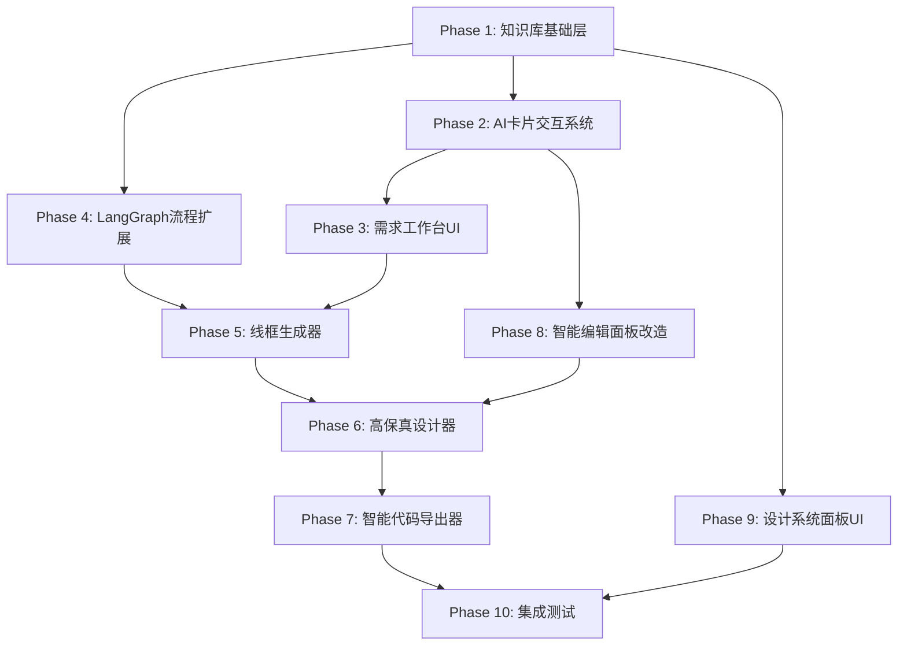

# H2D Studio 增强实施计划

## 概述

本计划基于设计方案第一至第四部分的讨论，将 H2D Studio 从「纯文字讨论设计」升级为「实际执行设计」的系统。核心改造包括：

1. **知识库基础层** — 从已捕获页面自动提取设计规范
2. **AI 卡片交互系统** — 替代大段文字，用可点击卡片引导用户
3. **执行层** — 线框生成、高保真设计、智能代码导出三个关键执行节点
4. **三个新/改造界面** — 需求工作台、智能编辑面板、设计系统面板

---

## 依赖关系图



---

## Phase 1: 知识库基础层 — 后端服务

### 目标
从项目已捕获的页面中自动提取设计规范，构建项目级知识库，供后续所有 AI 功能参考。

### 新增文件

#### 1.1 `server/src/services/knowledgeBase.ts` — 知识库核心服务

```typescript
// 核心接口定义
export interface DesignSystemKnowledge {
  projectId: string;
  colors: ColorToken[];        // 色彩系统
  typography: TypographyToken[]; // 字体规范
  spacing: SpacingToken[];     // 间距系统
  borderRadius: BorderRadiusToken[]; // 圆角
  shadows: ShadowToken[];      // 阴影
  componentPatterns: ComponentPattern[]; // 组件模式
  layoutPatterns: LayoutPattern[]; // 布局模式
  updatedAt: string;
}

export interface ColorToken {
  value: string;          // '#1a73e8'
  usage: string;          // 'primary' | 'secondary' | 'accent' | 'background' | 'text'
  frequency: number;      // 使用次数
  sourcePages: string[];  // 来源页面ID
}

export interface TypographyToken {
  fontSize: string;       // '14px'
  fontWeight: string;     // '400' | '500' | '600' | '700'
  fontFamily: string;     // 字体族
  lineHeight: string;     // '1.5'
  usage: string;          // 'heading' | 'body' | 'caption' | 'label'
  frequency: number;
  sourcePages: string[];
}

export interface SpacingToken {
  value: number;          // 16
  unit: string;           // 'px'
  frequency: number;
  sourcePages: string[];
}

export interface ComponentPattern {
  name: string;           // 'card' | 'form' | 'table' | 'navbar' | 'list'
  description: string;    // AI 生成的组件描述
  structure: unknown;     // 简化的 CaptureTree 子树
  styles: Record<string, string>; // 典型样式
  frequency: number;      // 出现次数
  sourcePages: string[];
}

export interface LayoutPattern {
  name: string;           // 'sidebar-content' | 'full-width-list' | 'centered-form'
  description: string;
  structure: unknown;     // 布局骨架
  frequency: number;
  sourcePages: string[];
}
```

**核心方法：**
- `buildKnowledgeBase(projectId: string): Promise<DesignSystemKnowledge>` — 扫描所有页面，提取设计规范
- `getKnowledgeBase(projectId: string): Promise<DesignSystemKnowledge | null>` — 获取缓存的知识库
- `updateKnowledgeBase(projectId: string, pageId: string): Promise<void>` — 增量更新（新捕获页面后）
- `toContextString(knowledge: DesignSystemKnowledge): string` — 转为 AI 可读的文本上下文

#### 1.2 `server/src/services/designExtractor.ts` — 设计规范提取器

**职责：** 遍历 CaptureTree，提取颜色、字体、间距、圆角、阴影等设计 token。

**核心方法：**
- `extractColors(tree: CaptureTree): ColorToken[]` — 从 styles 中提取所有颜色值，按频率排序
- `extractTypography(tree: CaptureTree): TypographyToken[]` — 提取字号/字重/行高组合
- `extractSpacing(tree: CaptureTree): SpacingToken[]` — 提取 margin/padding/gap 值
- `extractBorderRadius(tree: CaptureTree): BorderRadiusToken[]` — 提取圆角值
- `extractShadows(tree: CaptureTree): ShadowToken[]` — 提取 box-shadow 值

#### 1.3 `server/src/services/patternRecognizer.ts` — 组件/布局模式识别器

**职责：** 使用 AI + 规则引擎识别 CaptureTree 中的组件模式和布局模式。

**核心方法：**
- `recognizeComponents(tree: CaptureTree, projectId: string): Promise<ComponentPattern[]>` — AI 辅助识别组件
- `recognizeLayouts(tree: CaptureTree): LayoutPattern[]` — 基于规则识别布局模式（flex 方向、grid 列数等）
- `matchComponentPattern(node: ElementSnapshot, patterns: ComponentPattern[]): ComponentPattern | null` — 匹配最相似的模式

#### 1.4 `server/src/routes/knowledge.ts` — 知识库 API 路由

```
GET    /api/knowledge/:projectId           — 获取项目知识库
POST   /api/knowledge/:projectId/rebuild   — 重新构建知识库
POST   /api/knowledge/:projectId/update    — 增量更新（指定页面）
```

### 修改文件

#### 1.5 `server/src/types.ts` — 新增知识库相关类型

在现有类型文件中追加 `DesignSystemKnowledge` 及其子类型定义。

#### 1.6 `server/src/index.ts` — 注册知识库路由

```typescript
import knowledgeRouter from './routes/knowledge.js';
app.use('/api/knowledge', knowledgeRouter);
```

#### 1.7 `server/src/services/storage.ts` — 新增知识库存储

- 知识库 JSON 存储在 `server/data/projects/{projectId}/knowledge.json`
- 复用现有的文件系统存储模式

---

## Phase 2: AI 卡片交互系统

### 目标
定义 AI 输出的结构化交互 Schema，前端根据 Schema 渲染为可点击的卡片/按钮，替代大段文字回复。

### 新增文件

#### 2.1 `server/src/types/interactionSchema.ts` — 交互 Schema 类型定义

```typescript
// AI 返回的交互式消息，不再是纯文本
export interface InteractionMessage {
  id: string;
  type: 'text' | 'choice' | 'multi-choice' | 'confirm' | 'preview' | 'summary';
  content: string;           // 标题/描述文字（简短）
  options?: InteractionOption[]; // 选择项
  preview?: PreviewData;     // 预览数据（线框/设计稿）
  metadata?: Record<string, unknown>;
}

export interface InteractionOption {
  id: string;
  label: string;             // 显示文字
  description?: string;      // 补充说明
  icon?: string;             // 图标 emoji
  value: string;             // 选中后返回的值
  preview?: PreviewData;     // 选中后的预览
}

export interface PreviewData {
  type: 'wireframe' | 'hifi' | 'code' | 'diff';
  captureTree?: unknown;     // CaptureTree JSON
  code?: string;             // 代码预览
  diff?: DiffItem[];         // 变更差异
}

export interface DiffItem {
  nodeId: string;
  action: 'modify' | 'add' | 'delete';
  description: string;
  before?: unknown;
  after?: unknown;
}

// 用户的选择结果
export interface InteractionResponse {
  messageId: string;
  selectedOptions: string[];  // 选中的 option id 列表
  customInput?: string;       // 用户自定义输入
}
```

#### 2.2 `server/src/services/interactionBuilder.ts` — AI 交互构建器

**职责：** 将 AI 的原始文本输出解析为结构化的 `InteractionMessage[]`。

**核心方法：**
- `parseAIResponse(rawContent: string): InteractionMessage[]` — 解析 AI 输出中的交互定义
- `buildChoiceMessages(question: string, options: Array<{label: string; value: string}>): InteractionMessage[]` — 构建选择题
- `buildConfirmMessage(title: string, changes: DiffItem[]): InteractionMessage` — 构建确认消息
- `buildPreviewMessage(captureTree: unknown, type: string): InteractionMessage` — 构建预览消息

#### 2.3 `web/src/components/interaction/InteractionCard.tsx` — 卡片渲染引擎

**职责：** 根据 `InteractionMessage.type` 渲染不同的 UI 组件。

支持的渲染类型：
- `text` → 简短文字气泡
- `choice` → 单选卡片列表（每次只问一个维度）
- `multi-choice` → 多选卡片列表
- `confirm` → 确认/取消按钮 + 变更摘要
- `preview` → 画布实时预览 + 叠加层
- `summary` → 最终方案汇总 + 应用/调整/取消

#### 2.4 `web/src/components/interaction/ChoiceCard.tsx` — 选择卡片组件
#### 2.5 `web/src/components/interaction/ConfirmCard.tsx` — 确认卡片组件
#### 2.6 `web/src/components/interaction/PreviewCard.tsx` — 预览卡片组件
#### 2.7 `web/src/components/interaction/SummaryCard.tsx` — 汇总卡片组件
#### 2.8 `web/src/components/interaction/InteractionEngine.tsx` — 交互引擎（状态管理）

**职责：** 管理多步交互流程的状态（第1步/共3步），处理用户选择，调用回调。

### 修改文件

#### 2.9 `web/src/api/client.ts` — 新增交互 API

```typescript
// 交互式 Agent API
export async function createInteractionSession(projectId: string, idea: string) {
  return apiPost<InteractionSession>('/agent/interactive/sessions', { projectId, idea });
}

export async function sendInteractionResponse(sessionId: string, response: InteractionResponse) {
  return apiPost<InteractionReply>('/agent/interactive/sessions/' + sessionId + '/respond', response);
}
```

---

## Phase 3: 需求工作台 UI

### 目标
新增「需求工作台」页面，作为功能一（需求→设计）的入口，左侧对话区 + 右侧预览区 + 底部进度条。

### 新增文件

#### 3.1 `web/src/pages/Workbench.tsx` — 需求工作台页面

**布局结构：**
```
┌─────────────────────────────────────────────────────┐
│  需求工作台                               [导出 ▾]   │
├────────────────────┬────────────────────────────────┤
│  对话区域           │  预览/文档区域                   │
│  (InteractionCard)  │  [架构概要][PRD][线框][设计稿]   │
│                    │  (标签页切换)                    │
│                    │                                │
│  ┌──────────────┐  │  当前阶段的可视化产出             │
│  │ 输入需求...   │  │                                │
│  │         [发送]│  │                                │
│  └──────────────┘  │                                │
├────────────────────┴────────────────────────────────┤
│  ● 需求 → ● PRD → ○ 设计原则 → ○ 线框 → ○ 高保真    │
└─────────────────────────────────────────────────────┘
```

#### 3.2 `web/src/pages/Workbench.css` — 样式文件

#### 3.3 `web/src/components/workbench/ChatArea.tsx` — 对话区域组件

**职责：** 展示 AI 对话消息，使用 `InteractionCard` 渲染 AI 回复（卡片式），支持文字输入。

#### 3.4 `web/src/components/workbench/PreviewArea.tsx` — 预览区域组件

**职责：** 根据当前阶段展示不同内容：
- 架构概要阶段：显示架构图文字描述
- PRD 阶段：渲染 Markdown PRD 文档
- 线框阶段：在 Canvas 中渲染线框 CaptureTree
- 高保真阶段：在 Canvas 中渲染高保真 CaptureTree

#### 3.5 `web/src/components/workbench/StageProgress.tsx` — 阶段进度条组件

**职责：** 显示当前进度（需求→PRD→设计原则→线框→高保真→代码），可点击回溯。

#### 3.6 `web/src/components/workbench/DocumentViewer.tsx` — 文档查看器

**职责：** 渲染 Markdown PRD 文档，支持目录导航。

### 修改文件

#### 3.7 `web/src/App.tsx` — 新增路由

```typescript
import Workbench from './pages/Workbench.tsx';
// 在 Routes 中添加：
<Route path="workbench/:projectId" element={<Workbench />} />
```

#### 3.8 `web/src/components/Layout.tsx` — 顶部导航扩展

在导航栏中添加「需求工作台」入口。

---

## Phase 4: ProductAgent LangGraph 流程扩展

### 目标
扩展现有 `productAgent.ts` 的 LangGraph 流程，新增 `designPrinciples`、`wireframeGenerate`、`hifiDesign`、`codeExport` 四个节点，替换原来的 `prototype` 节点。

### 修改文件

#### 4.1 `server/src/services/productAgent.ts` — 核心改造

**当前流程：**
```
discovery → clarify → requirement → prd → prototype → done
```

**改造后流程：**
```
discovery → clarify → requirement → prd → designPrinciples
    → wireframeGenerate → hifiDesign → codeExport → done
```

**新增 State 字段：**
```typescript
// 在 AgentStateAnnotation 中新增：
knowledgeContext: Annotation<string>     // 知识库上下文
designPrinciplesDoc: Annotation<string>  // 设计原则文档
wireframeTree: Annotation<unknown>       // 线框 CaptureTree
hifiTree: Annotation<unknown>            // 高保真 CaptureTree
generatedCode: Annotation<string>        // 生成的代码
interactionMessages: Annotation<InteractionMessage[]>  // 卡片式交互消息
currentStep: Annotation<number>          // 当前步骤编号
totalSteps: Annotation<number>           // 总步骤数
```

**新增节点函数：**
- `designPrinciplesNode` — 基于知识库生成设计原则
- `wireframeGenerateNode` — 调用 WireframeGenerator 生成线框
- `hifiDesignNode` — 调用 HiFiDesigner 填充样式
- `codeExportNode` — 调用 SmartCodeGenerator 生成代码

**改造交互模式：**
- `clarifyNode` 改为输出 `InteractionMessage[]`（卡片式提问）
- 每个执行节点后插入人工确认点（用户通过卡片确认/调整）
- `routeAfterClarify` 等路由函数适配新流程

#### 4.2 `server/src/routes/agent.ts` — 新增交互式 API

```
POST /api/agent/interactive/sessions              — 创建交互式会话
POST /api/agent/interactive/sessions/:id/respond   — 回复交互（选择卡片）
GET  /api/agent/interactive/sessions/:id/state     — 获取当前状态
POST /api/agent/interactive/sessions/:id/confirm   — 确认当前阶段产出
POST /api/agent/interactive/sessions/:id/rollback  — 回退到指定阶段
```

---

## Phase 5: 线框生成器（WireframeGenerator）

### 目标
根据 PRD 文档 + 知识库中的布局/组件模式，生成低保真的 CaptureTree JSON（线框级别）。

### 新增文件

#### 5.1 `server/src/services/wireframeGenerator.ts` — 线框生成器

**核心逻辑：**

```
输入: PRD 文档 + 知识库（布局模式 + 组件模式）
  ↓
1. AI 分析 PRD 中的「页面变更清单」
  ↓
2. 从知识库匹配最相似的布局模式
   (PRD 说"用户列表页" → 匹配 "侧边栏+表格" 布局)
  ↓
3. AI 生成 CaptureTree 骨架结构
   (只有布局框架，灰色占位块，无真实样式)
  ↓
4. 布局引擎计算 rect 值
   (确保子元素尺寸与父容器协调)
  ↓
输出: CaptureTree JSON (标记为 "wireframe" 类型)
```

**核心方法：**
- `generate(prd: string, knowledge: DesignSystemKnowledge): Promise<WireframeResult>` — 主入口
- `matchLayoutPattern(pageDescription: string, patterns: LayoutPattern[]): LayoutPattern` — 匹配布局
- `buildSkeleton(layout: LayoutPattern, components: ComponentPattern[]): CaptureTree` — 构建骨架
- `calculateRects(tree: CaptureTree): CaptureTree` — 计算几何 rect 值

**关键设计决策：**
- 线框使用灰色占位色 `#e0e0e0`，文字使用 `#999`
- 每个占位块标注其语义角色（如「搜索栏」「表格」「分页」）
- rect 计算参考知识库中的实际页面尺寸

#### 5.2 `server/src/services/layoutEngine.ts` — 布局计算引擎

**职责：** 类似浏览器的 layout 算法，根据 CSS flex/grid 属性计算子元素的 rect 值。

**核心方法：**
- `layout(tree: CaptureTree): CaptureTree` — 主布局计算
- `layoutFlex(container: ElementSnapshot): ElementSnapshot` — flex 布局计算
- `layoutGrid(container: ElementSnapshot): ElementSnapshot` — grid 布局计算
- `layoutBlock(container: ElementSnapshot): ElementSnapshot` — block 布局计算

---

## Phase 6: 高保真设计器（HiFiDesigner）

### 目标
将线框 CaptureTree 填充为高保真设计，应用知识库中的真实样式。

### 新增文件

#### 6.1 `server/src/services/hifiDesigner.ts` — 高保真设计器

**核心逻辑：**

```
输入: 线框 CaptureTree + 知识库（色彩/字体/间距/组件模式）
  ↓
1. 遍历线框中的每个占位元素
  ↓
2. 匹配知识库中的组件模式
   (占位块标注为"卡片" → 匹配 Card 组件模式)
  ↓
3. AI 将设计规范「填入」线框骨架
   - 应用颜色、字体、间距
   - 应用组件的完整样式（圆角、阴影、padding）
   - 生成占位内容（真实文案而非 lorem ipsum）
  ↓
4. 布局引擎重新计算 rect（因为填充内容后尺寸可能变化）
  ↓
输出: 高保真 CaptureTree JSON (标记为 "hifi" 类型)
```

**核心方法：**
- `design(wireframe: CaptureTree, knowledge: DesignSystemKnowledge): Promise<HifiResult>` — 主入口
- `matchComponent(node: ElementSnapshot, patterns: ComponentPattern[]): ComponentPattern | null` — 组件匹配
- `applyStyles(node: ElementSnapshot, pattern: ComponentPattern, knowledge: DesignSystemKnowledge): ElementSnapshot` — 应用样式
- `generateContent(node: ElementSnapshot, context: string): Promise<ElementSnapshot>` — AI 生成真实内容

---

## Phase 7: 智能代码导出器（SmartCodeGenerator）

### 目标
替换现有粗暴的 `dangerouslySetInnerHTML` 方式，生成语义化的 React/Vue 组件代码。

### 新增文件

#### 7.1 `server/src/services/smartCodegen.ts` — 智能代码生成器

**核心逻辑：**

```
输入: 高保真 CaptureTree + 知识库（组件模式）
  ↓
1. AI 分析 CaptureTree 中的子树结构
  ↓
2. 识别组件边界（哪些子树是独立组件）
  ↓
3. 匹配知识库中的组件模式
  ↓
4. 生成语义化组件代码：
   - <Card title="猪源信息"> 而非 <div style="...">
   - <InfoRow label="体重" value="120kg" /> 而非 <div><span>...
   - 提取可复用组件到单独文件
  ↓
输出: 组件文件 + 样式文件 + 类型定义 + index 导出
```

**核心方法：**
- `generate(hifiTree: CaptureTree, knowledge: DesignSystemKnowledge, options: CodeGenOptions): Promise<CodegenResult>` — 主入口
- `identifyComponentBoundaries(tree: CaptureTree): ComponentBoundary[]` — 识别组件边界
- `generateComponentCode(component: ElementSnapshot, patterns: ComponentPattern[]): Promise<string>` — 生成组件代码
- `generateStyles(component: ElementSnapshot): string` — 生成样式

**CodegenResult 结构：**
```typescript
export interface CodegenResult {
  files: Array<{
    path: string;       // 'components/Card.tsx'
    content: string;    // 文件内容
    language: string;   // 'typescript' | 'css'
  }>;
  mainComponent: string; // 主组件文件路径
  dependencies: string[]; // 依赖列表
}
```

### 修改文件

#### 7.2 `server/src/routes/export.ts` — 使用 SmartCodeGenerator

在导出路由中，检测到知识库存在时使用 `SmartCodeGenerator`，否则回退到现有 `CodeGenService`。

---

## Phase 8: 智能编辑面板改造

### 目标
改造现有编辑器右侧面板，将 AI 编辑功能从纯文字交互升级为卡片式交互。

### 修改文件

#### 8.1 `web/src/components/editor/AIPanel.tsx` — 核心改造

**改造要点：**
- 新增 `mode` 切换：`[属性] [AI编辑]` 两个标签页
- AI 编辑标签页使用 `InteractionEngine` 管理多步交互
- 每次只问一个维度，用 `ChoiceCard` 渲染选项
- 选中后画布实时预览（半透明叠加）
- 最终用 `SummaryCard` 展示变更摘要 + 关联影响分析
- 用户确认「应用」后执行变更，支持撤销

#### 8.2 `web/src/components/editor/AIPanel.css` — 样式更新

#### 8.3 `web/src/stores/editorStore.ts` — 新增交互状态

```typescript
// 新增状态：
interactionMessages: InteractionMessage[];
interactionStep: number;
interactionTotalSteps: number;
previewOverlay: CaptureTree | null;  // 半透明预览层

// 新增方法：
setInteractionMessages: (messages: InteractionMessage[]) => void;
setPreviewOverlay: (tree: CaptureTree | null) => void;
applyInteractionResult: (changes: DiffItem[]) => void;
```

#### 8.4 `web/src/components/editor/Canvas.tsx` — 支持预览叠加层

在 Canvas 中新增半透明预览渲染层，显示 AI 建议的变更效果。

---

## Phase 9: 设计系统面板 UI

### 目标
新增「设计系统」页面，可视化展示知识库内容，让用户确认和微调 AI 提取的设计规范。

### 新增文件

#### 9.1 `web/src/pages/DesignSystem.tsx` — 设计系统页面

**布局结构：**
```
┌──────────────────────────────────────────────────────┐
│  设计系统 — 从已捕获页面自动提取           [重新扫描]  │
├──────────────────────────────────────────────────────┤
│  ┌─ 色彩系统 ────────┐  ┌─ 字体规范 ────────────┐   │
│  │ 主色 #1a73e8      │  │ 标题 24px / Medium    │   │
│  │ 辅色 #5f6368      │  │ 正文 14px / Regular   │   │
│  │ [色彩板]          │  │ 辅助 12px / Light     │   │
│  └───────────────────┘  └───────────────────────┘   │
│  ┌─ 间距系统 ────────┐  ┌─ 组件模式库 ──────────┐   │
│  │ 4 8 12 16 24 32   │  │ 导航栏×5  表单×8      │   │
│  │ [频率柱状图]       │  │ 卡片×12  表格×3      │   │
│  └───────────────────┘  └───────────────────────┘   │
│  ┌─ 页面布局模式 ─────────────────────────────────┐  │
│  │ 侧边栏+内容 ×4  |  全宽列表 ×3  |  表单居中 ×2 │  │
│  └────────────────────────────────────────────────┘  │
│  来源页面: [页面A] [页面B] [页面C]                    │
└──────────────────────────────────────────────────────┘
```

#### 9.2 `web/src/pages/DesignSystem.css` — 样式文件

#### 9.3 `web/src/components/designsystem/ColorPalette.tsx` — 色彩系统组件
#### 9.4 `web/src/components/designsystem/TypographyPanel.tsx` — 字体规范组件
#### 9.5 `web/src/components/designsystem/SpacingChart.tsx` — 间距图表组件
#### 9.6 `web/src/components/designsystem/ComponentGallery.tsx` — 组件模式库组件
#### 9.7 `web/src/components/designsystem/LayoutGallery.tsx` — 布局模式库组件

### 修改文件

#### 9.8 `web/src/App.tsx` — 新增路由

```typescript
import DesignSystem from './pages/DesignSystem.tsx';
<Route path="design-system/:projectId" element={<DesignSystem />} />
```

#### 9.9 `web/src/components/Layout.tsx` — 导航栏添加「设计系统」入口

---

## Phase 10: 集成测试与调试

### 目标
全链路功能验证，确保知识库→AI交互→执行层→UI 的完整流程可用。

### 测试场景

1. **知识库构建测试**
   - 捕获一个页面 → 触发知识库构建 → 验证提取的 token 是否正确
   - 捕获多个页面 → 验证频率统计和模式识别

2. **需求工作台端到端测试**
   - 创建需求 → AI 卡片式提问 → 用户选择 → PRD 生成 → 线框生成 → 高保真 → 代码导出
   - 验证每个阶段的产出物格式正确
   - 验证阶段回溯功能

3. **智能编辑面板测试**
   - 选中元素 → AI 编辑 → 卡片式交互 → 预览 → 应用
   - 验证变更正确应用到 CaptureTree
   - 验证撤销功能

4. **设计系统面板测试**
   - 展示提取的设计规范
   - 手动微调后验证知识库更新
   - 重新扫描后验证增量更新

5. **代码导出质量测试**
   - 对比 SmartCodeGenerator 和现有 CodeGenService 的输出
   - 验证生成的 React/Vue 代码可编译运行

---

## 文件变更汇总

### 新增文件（共 ~25 个）

| 文件路径 | Phase | 说明 |
|---------|-------|------|
| `server/src/services/knowledgeBase.ts` | 1 | 知识库核心服务 |
| `server/src/services/designExtractor.ts` | 1 | 设计规范提取器 |
| `server/src/services/patternRecognizer.ts` | 1 | 组件/布局模式识别 |
| `server/src/routes/knowledge.ts` | 1 | 知识库 API 路由 |
| `server/src/types/interactionSchema.ts` | 2 | 交互 Schema 类型 |
| `server/src/services/interactionBuilder.ts` | 2 | AI 交互构建器 |
| `web/src/components/interaction/InteractionCard.tsx` | 2 | 卡片渲染引擎 |
| `web/src/components/interaction/ChoiceCard.tsx` | 2 | 选择卡片 |
| `web/src/components/interaction/ConfirmCard.tsx` | 2 | 确认卡片 |
| `web/src/components/interaction/PreviewCard.tsx` | 2 | 预览卡片 |
| `web/src/components/interaction/SummaryCard.tsx` | 2 | 汇总卡片 |
| `web/src/components/interaction/InteractionEngine.tsx` | 2 | 交互引擎 |
| `web/src/pages/Workbench.tsx` | 3 | 需求工作台页面 |
| `web/src/pages/Workbench.css` | 3 | 工作台样式 |
| `web/src/components/workbench/ChatArea.tsx` | 3 | 对话区域 |
| `web/src/components/workbench/PreviewArea.tsx` | 3 | 预览区域 |
| `web/src/components/workbench/StageProgress.tsx` | 3 | 阶段进度条 |
| `web/src/components/workbench/DocumentViewer.tsx` | 3 | 文档查看器 |
| `server/src/services/wireframeGenerator.ts` | 5 | 线框生成器 |
| `server/src/services/layoutEngine.ts` | 5 | 布局计算引擎 |
| `server/src/services/hifiDesigner.ts` | 6 | 高保真设计器 |
| `server/src/services/smartCodegen.ts` | 7 | 智能代码生成器 |
| `web/src/pages/DesignSystem.tsx` | 9 | 设计系统页面 |
| `web/src/pages/DesignSystem.css` | 9 | 设计系统样式 |
| `web/src/components/designsystem/*.tsx` | 9 | 设计系统子组件（5个） |

### 修改文件（共 ~10 个）

| 文件路径 | Phase | 说明 |
|---------|-------|------|
| `server/src/types.ts` | 1 | 新增知识库类型 |
| `server/src/index.ts` | 1,4 | 注册新路由 |
| `server/src/services/productAgent.ts` | 4 | 扩展 LangGraph 流程 |
| `server/src/routes/agent.ts` | 4 | 新增交互式 API |
| `server/src/routes/export.ts` | 7 | 集成 SmartCodeGenerator |
| `web/src/App.tsx` | 3,9 | 新增路由 |
| `web/src/components/Layout.tsx` | 3,9 | 导航扩展 |
| `web/src/components/editor/AIPanel.tsx` | 8 | 卡片化改造 |
| `web/src/stores/editorStore.ts` | 8 | 新增交互状态 |
| `web/src/components/editor/Canvas.tsx` | 8 | 预览叠加层 |
| `web/src/api/client.ts` | 2,4 | 新增 API 方法 |

---

## 执行顺序建议

```
Phase 1 (知识库) ─────────────────────────────┐
                                              │
Phase 2 (卡片交互) ──────────────────────┐    │
                                         │    │
Phase 3 (需求工作台UI) ───── 依赖 P2     │    │
Phase 4 (LangGraph扩展) ──── 依赖 P1     │    │
                                         │    │
Phase 5 (线框生成器) ─────── 依赖 P1,P3,P4    │
Phase 8 (编辑面板改造) ───── 依赖 P2          │
                                              │
Phase 6 (高保真设计器) ───── 依赖 P5,P8       │
Phase 9 (设计系统UI) ────── 依赖 P1           │
                                              │
Phase 7 (代码导出器) ────── 依赖 P6           │
                                              │
Phase 10 (集成测试) ─────── 依赖全部          │
```

**可并行的 Phase：**
- Phase 1 和 Phase 2 可并行开发（无依赖）
- Phase 3 和 Phase 4 可并行（分别依赖 P2 和 P1）
- Phase 5 和 Phase 8 可并行（分别依赖不同前置）
- Phase 6 和 Phase 9 可并行

---

## 风险与应对

| 风险 | 影响 | 应对策略 |
|------|------|---------|
| AI 生成的 CaptureTree 格式不合法 | 线框/高保真阶段崩溃 | 严格的 Schema 验证 + `isValidCaptureTree` 校验 + 兜底默认值 |
| 布局引擎 rect 计算不准确 | 元素位置错乱 | 参考知识库中实际页面的 rect 值做类比，而非从零计算 |
| AI 交互卡片解析失败 | 用户看到原始 JSON | 前端 fallback：解析失败时显示为纯文本 |
| 知识库提取的设计规范不准确 | AI 生成的设计偏离项目风格 | 设计系统面板允许用户手动微调 |
| 大页面 CaptureTree 导致 AI token 超限 | 生成失败 | 分层处理：先提取摘要，再按需传入子树 |
